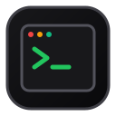
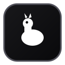
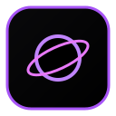
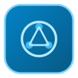
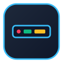

<div align="center">


# OpenMac

**The community-powered directory of genuinely open-source macOS apps, developer tools, and system utilities.**

<!-- STATS:START -->
[](#all-categories) [](#categories) [](#open-source-criteria) [](#open-source-criteria)
<!-- STATS:END -->

<p align="center">
  <a href="#table-of-contents"><b>Explore Apps</b></a> •
  <a href="#featured-projects"><b>Featured</b></a> •
  <a href="#how-to-contribute"><b>Add a Project</b></a> •
  <a href="./CONTRIBUTING.md"><b>Contribution Guide</b></a> •
  <a href="https://github.com/shareefmx/OpenMac/issues/new/choose"><b>Submit via Issue</b></a>
</p>

---

</div>

## 📖 About OpenMac

**OpenMac** is a curated, transparent, community-maintained catalog dedicated exclusively to **free and open-source software (FOSS)** built for macOS.

While directories like *awesome-mac* provide great utility, they frequently mix open-source software with closed-source freeware, proprietary trials, and commercial subscriptions. **OpenMac establishes a clear, uncompromising standard:**

> [!IMPORTANT]
> **The Golden Rule**: Every listed application in this directory must have a **publicly accessible source code repository** and operate under a recognized **OSI or FSF-approved open-source license**. No closed-source freeware. No proprietary freemium apps. No telemetry-heavy trials.

### Why Developers and Mac Users Love OpenMac
- 🛡️ **Auditability & Privacy**: Inspect the code running on your system. Know exactly what handles your clipboard, keystrokes, and network traffic.
- ⚡ **Native Performance**: Prioritizes modern Swift, SwiftUI, Rust, and Metal-accelerated tools tuned for Apple Silicon and Intel Macs.
- 🤖 **Automated & Verified**: Canonical metadata is strictly validated via automated CI to guarantee no dead links, missing icons, or license misrepresentations.
- 🤝 **Community-Governed**: Maintained by Mac developers and enthusiasts worldwide. Fork, submit, and improve.

---

## 🧭 Table of Contents

<!-- TOC:START -->
| Category | Focus Area | Projects |
| :--- | :--- | :---: |
| 🛠️ [Development](#development) | Code editors, IDEs, Git clients, API testing tools, and database management utilities. | `9` |
| 💻 [Terminal & Shell](#terminal-shell) | Terminal emulators, multiplexers, modern shells, prompt engines, and CLI power utilities. | `7` |
| 🪟 [Window Management](#window-management) | Tiling window managers, keyboard window snappers, and window switching enhancers. | `4` |
| ⚡ [Productivity](#productivity) | Application launchers, clipboard history, menubar organizers, and time management. | `8` |
| 🖥️ [System & Hardware](#system-hardware) | Hardware diagnostics, system resource monitors, uninstaller tools, and display controls. | `6` |
| 🤖 [AI & Machine Learning](#ai-machine-learning) | Local large language model runners, desktop AI frontends, and on-device ML workflows. | `5` |
| 🎬 [Media & Audio](#media-audio) | Modern video players, audio routers, screen recording suites, and video transcoders. | `7` |
| 🔒 [Security & Privacy](#security-privacy) | Password vaults, disk encryption, personal application firewalls, and privacy monitors. | `6` |
| 📝 [Notes & Writing](#notes-writing) | Local-first markdown editors, networked thought notebooks, and distraction-free writing. | `5` |
| 📂 [File Management & Sharing](#file-management-sharing) | Cloud storage sync, local peer-to-peer file transfer, archive utilities, and FTP clients. | `4` |
| 🎨 [Design & Creative](#design-creative) | Vector graphics illustration, 3D modeling, photo editing, and creative digital painting. | `4` |
| 🎛️ [Customization & Tweaks](#customization-tweaks) | Hardware key remapping, custom menubar scripts, dynamic notch tweaks, and desktop themes. | `3` |
<!-- TOC:END -->

---

## ⭐ Featured Projects

A curated selection of standout, mature, and widely acclaimed open-source macOS software distinguished by active community maintenance, exceptional UX, and deep platform integration.

<!-- FEATURED:START -->
| Icon | Project | Description | Stack | Links | License |
| :---: | :--- | :--- | :---: | :---: | :---: |
|  | **[AeroSpace](https://nikitabobko.github.io/AeroSpace)** | i3-like tiling window manager for macOS with tree-based workspace navigation. | `Swift` | [Code](https://github.com/nikitabobko/AeroSpace) | `MIT` |
|  | **[AltTab](https://alt-tab-macos.netlify.app)** | Brings Windows-style alt-tab window switcher functionality with live window previews to macOS. | `Swift` | [Code](https://github.com/lwouis/alt-tab-macos) | `GPL-3.0` |
|  | **[Bitwarden](https://bitwarden.com)** | Trusted open-source password manager with end-to-end encryption across all your devices. | `TypeScript` | [Code](https://github.com/bitwarden/clients) | `GPL-3.0` |
|  | **[Blender](https://www.blender.org)** | Open-source 3D creation suite supporting modeling, rigging, animation, simulation, and rendering with Metal. | `C++` | [Code](https://github.com/blender/blender) | `GPL-3.0` |
|  | **[Bruno](https://www.usebruno.com)** | Fast, git-friendly open-source API client for exploring and testing REST and GraphQL APIs. | `JavaScript` | [Code](https://github.com/usebruno/bruno) | `MIT` |
|  | **[Ghostty](https://ghostty.org)** | Fast, feature-rich, and cross-platform terminal emulator leveraging native macOS UI and GPU acceleration. | `Zig` | [Code](https://github.com/ghostty-org/ghostty) | `MIT` |
|  | **[Homebrew](https://brew.sh)** | The missing package manager for macOS and Linux, installing software packages from the CLI. | `Ruby` | [Code](https://github.com/Homebrew/brew) | `BSD-2-Clause` |
|  | **[IINA](https://iina.io)** | The modern media player for macOS, built with Swift and powered by mpv with native Picture-in-Picture. | `Swift` | [Code](https://github.com/iina/iina) | `GPL-3.0` |
|  | **[iTerm2](https://iterm2.com)** | Full-featured macOS terminal emulator with split panes, search, autocomplete, and tmux integration. | `Objective-C` | [Code](https://github.com/gnachman/iTerm2) | `GPL-2.0` |
|  | **[Jan](https://jan.ai)** | Open-source local AI conversational assistant that runs offline on your Mac with zero data tracking. | `TypeScript` | [Code](https://github.com/janhq/jan) | `AGPL-3.0` |
|  | **[Karabiner-Elements](https://karabiner-elements.pqrs.org)** | Powerful and stable keyboard customizer for macOS to remap keys and create complex modification rules. | `C++` | [Code](https://github.com/pqrs-org/Karabiner-Elements) | `MIT` |
|  | **[LocalSend](https://localsend.org)** | AirDrop alternative to share files and messages nearby across macOS, iOS, Android, and Windows. | `Dart` | [Code](https://github.com/localsend/localsend) | `MIT` |
|  | **[Logseq](https://logseq.com)** | Privacy-first, local-only platform for knowledge management and outliner journaling. | `Clojure` | [Code](https://github.com/logseq/logseq) | `AGPL-3.0` |
|  | **[LuLu](https://objective-see.org/products/lulu.html)** | Free, open-source macOS firewall aimed at blocking unauthorized outgoing network connections. | `Objective-C` | [Code](https://github.com/objective-see/LuLu) | `GPL-3.0` |
|  | **[Maccy](https://maccy.app)** | Lightweight, native clipboard manager with search history and zero telemetry. | `Swift` | [Code](https://github.com/p0deje/Maccy) | `MIT` |
|  | **[Ollama](https://ollama.com)** | Get up and running with large language models locally on Apple Silicon and Intel Macs. | `Go` | [Code](https://github.com/ollama/ollama) | `MIT` |
|  | **[Pearcleaner](https://github.com/alienator88/Pearcleaner)** | Open-source Mac app uninstaller inspired by AppCleaner, written cleanly in native SwiftUI. | `Swift` | [Code](https://github.com/alienator88/Pearcleaner) | `GPL-3.0` |
|  | **[Rectangle](https://rectangleapp.com)** | Move and resize windows on macOS using keyboard shortcuts and snap areas. | `Swift` | [Code](https://github.com/rxhanson/Rectangle) | `MIT` |
|  | **[Stats](https://github.com/exelban/stats)** | Menu bar system monitor showing CPU, GPU, memory, disks, sensors, battery, and network speeds. | `Swift` | [Code](https://github.com/exelban/stats) | `MIT` |
|  | **[VSCodium](https://vscodium.com)** | Community-driven, telemetry-free binary distribution of Microsoft's VS Code editor. | `TypeScript` | [Code](https://github.com/VSCodium/vscodium) | `MIT` |
|  | **[Zed](https://zed.dev)** | High-performance, multiplayer code editor written in Rust with GPU-accelerated rendering. | `Rust` | [Code](https://github.com/zed-industries/zed) | `GPL-3.0` |
<!-- FEATURED:END -->

---

## 🗂️ All Categories

<!-- PROJECTS:START -->
### 🛠️ Development

> Code editors, IDEs, Git clients, API testing tools, and database management utilities.

| Icon | Project | Description | Stack | Links | License |
| :---: | :--- | :--- | :---: | :---: | :---: |
|  | **[Beekeeper Studio](https://www.beekeeperstudio.io)** | Modern, easy-to-use SQL editor and database management tool supporting Postgres, MySQL, and SQLite. | `TypeScript` | [Website](https://www.beekeeperstudio.io) • [Source](https://github.com/beekeeper-studio/beekeeper-studio) | `GPL-3.0` |
|  | **[Bruno](https://www.usebruno.com)** | Fast, git-friendly open-source API client for exploring and testing REST and GraphQL APIs. | `JavaScript` | [Website](https://www.usebruno.com) • [Source](https://github.com/usebruno/bruno) | `MIT` |
|  | **[Colima](https://github.com/abiosoft/colima)** | Container runtimes (Docker and containerd) on macOS with minimal resource consumption. | `Go` | [Source](https://github.com/abiosoft/colima) | `MIT` |
|  | **[CotEditor](https://coteditor.com)** | Lightweight, pure native plain-text editor designed exclusively for macOS. | `Swift` | [Website](https://coteditor.com) • [Source](https://github.com/coteditor/CotEditor) | `Apache-2.0` |
|  | **[GitUp](https://gitup.co)** | Direct-manipulation Git client offering a non-linear graph visualization and instant undo. | `Objective-C` | [Website](https://gitup.co) • [Source](https://github.com/git-up/GitUp) | `GPL-3.0` |
|  | **[MacVim](https://macvim-dev.github.io/macvim)** | Vim text editor port designed to look and behave natively on macOS with full GUI integration. | `C` | [Website](https://macvim-dev.github.io/macvim) • [Source](https://github.com/macvim-dev/macvim) | `Vim` |
|  | **[Podman Desktop](https://podman-desktop.io)** | Desktop environment to manage containers, Kubernetes, and local development environments. | `TypeScript` | [Website](https://podman-desktop.io) • [Source](https://github.com/containers/podman-desktop) | `Apache-2.0` |
|  | **[VSCodium](https://vscodium.com)** | Community-driven, telemetry-free binary distribution of Microsoft's VS Code editor. | `TypeScript` | [Website](https://vscodium.com) • [Source](https://github.com/VSCodium/vscodium) | `MIT` |
|  | **[Zed](https://zed.dev)** | High-performance, multiplayer code editor written in Rust with GPU-accelerated rendering. | `Rust` | [Website](https://zed.dev) • [Source](https://github.com/zed-industries/zed) | `GPL-3.0` |

[⬆ Back to Top](#table-of-contents)


### 💻 Terminal & Shell

> Terminal emulators, multiplexers, modern shells, prompt engines, and CLI power utilities.

| Icon | Project | Description | Stack | Links | License |
| :---: | :--- | :--- | :---: | :---: | :---: |
|  | **[Alacritty](https://alacritty.org)** | Cross-platform, GPU-accelerated terminal emulator focused on simplicity and maximum performance. | `Rust` | [Website](https://alacritty.org) • [Source](https://github.com/alacritty/alacritty) | `Apache-2.0` |
|  | **[Ghostty](https://ghostty.org)** | Fast, feature-rich, and cross-platform terminal emulator leveraging native macOS UI and GPU acceleration. | `Zig` | [Website](https://ghostty.org) • [Source](https://github.com/ghostty-org/ghostty) | `MIT` |
|  | **[iTerm2](https://iterm2.com)** | Full-featured macOS terminal emulator with split panes, search, autocomplete, and tmux integration. | `Objective-C` | [Website](https://iterm2.com) • [Source](https://github.com/gnachman/iTerm2) | `GPL-2.0` |
|  | **[Kitty](https://sw.kovidgoyal.net/kitty)** | Cross-platform, fast, feature-rich, GPU-based terminal emulator with graphics support. | `Python` | [Website](https://sw.kovidgoyal.net/kitty) • [Source](https://github.com/kovidgoyal/kitty) | `GPL-3.0` |
|  | **[Starship](https://starship.rs)** | Minimal, blazing-fast, and infinitely customizable cross-shell prompt for any shell. | `Rust` | [Website](https://starship.rs) • [Source](https://github.com/starship/starship) | `ISC` |
|  | **[WezTerm](https://wezfurlong.org/wezterm)** | GPU-accelerated cross-platform terminal emulator and multiplexer written in Rust. | `Rust` | [Website](https://wezfurlong.org/wezterm) • [Source](https://github.com/wez/wezterm) | `MIT` |
|  | **[Zellij](https://zellij.dev)** | Terminal workspace manager and multiplexer with built-in layout engines and plugin architecture. | `Rust` | [Website](https://zellij.dev) • [Source](https://github.com/zellij-org/zellij) | `MIT` |

[⬆ Back to Top](#table-of-contents)


### 🪟 Window Management

> Tiling window managers, keyboard window snappers, and window switching enhancers.

| Icon | Project | Description | Stack | Links | License |
| :---: | :--- | :--- | :---: | :---: | :---: |
|  | **[AeroSpace](https://nikitabobko.github.io/AeroSpace)** | i3-like tiling window manager for macOS with tree-based workspace navigation. | `Swift` | [Website](https://nikitabobko.github.io/AeroSpace) • [Source](https://github.com/nikitabobko/AeroSpace) | `MIT` |
|  | **[Amethyst](https://ianyh.com/amethyst)** | Automatic tiling window manager for macOS inspired by xmonad. | `Swift` | [Website](https://ianyh.com/amethyst) • [Source](https://github.com/ianyh/Amethyst) | `MIT` |
|  | **[Rectangle](https://rectangleapp.com)** | Move and resize windows on macOS using keyboard shortcuts and snap areas. | `Swift` | [Website](https://rectangleapp.com) • [Source](https://github.com/rxhanson/Rectangle) | `MIT` |
|  | **[yabai](https://github.com/koekeishiya/yabai)** | Tiling window management utility for macOS based on binary space partitioning. | `C` | [Source](https://github.com/koekeishiya/yabai) | `MIT` |

[⬆ Back to Top](#table-of-contents)


### ⚡ Productivity

> Application launchers, clipboard history, menubar organizers, and time management.

| Icon | Project | Description | Stack | Links | License |
| :---: | :--- | :--- | :---: | :---: | :---: |
|  | **[AltTab](https://alt-tab-macos.netlify.app)** | Brings Windows-style alt-tab window switcher functionality with live window previews to macOS. | `Swift` | [Website](https://alt-tab-macos.netlify.app) • [Source](https://github.com/lwouis/alt-tab-macos) | `GPL-3.0` |
|  | **[Flameshot](https://flameshot.org)** | Powerful yet simple to use screenshot software with in-place annotation and editing. | `C++` | [Website](https://flameshot.org) • [Source](https://github.com/flameshot-org/flameshot) | `GPL-3.0` |
|  | **[Hidden Bar](https://github.com/dwarvesf/hidden)** | Ultra-lightweight menu bar utility that gives Mac users full control over menu bar icons. | `Swift` | [Source](https://github.com/dwarvesf/hidden) | `MIT` |
|  | **[Ice](https://github.com/jordanbaird/Ice)** | Powerful menu bar manager that lets you hide, show, and organize menu bar items. | `Swift` | [Source](https://github.com/jordanbaird/Ice) | `MIT` |
|  | **[Kap](https://getkap.co)** | Open-source screen recorder built with web technologies that exports to GIF, MP4, and WebM. | `TypeScript` | [Website](https://getkap.co) • [Source](https://github.com/wulkano/kap) | `MIT` |
|  | **[LinearMouse](https://linearmouse.app)** | Utility to customize mouse and trackpad acceleration, scrolling direction, and cursor behaviors. | `Swift` | [Website](https://linearmouse.app) • [Source](https://github.com/linearmouse/linearmouse) | `MIT` |
|  | **[Maccy](https://maccy.app)** | Lightweight, native clipboard manager with search history and zero telemetry. | `Swift` | [Website](https://maccy.app) • [Source](https://github.com/p0deje/Maccy) | `MIT` |
|  | **[Sol](https://github.com/ospfranco/sol)** | Open-source macOS launcher with calendar integration, window management, and bookmarks. | `TypeScript` | [Source](https://github.com/ospfranco/sol) | `MIT` |

[⬆ Back to Top](#table-of-contents)


### 🖥️ System & Hardware

> Hardware diagnostics, system resource monitors, uninstaller tools, and display controls.

| Icon | Project | Description | Stack | Links | License |
| :---: | :--- | :--- | :---: | :---: | :---: |
|  | **[Homebrew](https://brew.sh)** | The missing package manager for macOS and Linux, installing software packages from the CLI. | `Ruby` | [Website](https://brew.sh) • [Source](https://github.com/Homebrew/brew) | `BSD-2-Clause` |
|  | **[Keka](https://www.keka.io)** | Powerful file archiver for macOS supporting 7Z, ZIP, TAR, GZ, and password protection. | `Objective-C` | [Website](https://www.keka.io) • [Source](https://github.com/aonez/Keka) | `GPL-2.0` |
|  | **[Latest](https://max-langer.com/Latest)** | Native small utility that checks your installed Mac applications for available updates. | `Swift` | [Website](https://max-langer.com/Latest) • [Source](https://github.com/mangerlahn/Latest) | `MIT` |
|  | **[MonitorControl](https://github.com/MonitorControl/MonitorControl)** | Control external display brightness and volume using native Apple keyboard keys or slider controls. | `Swift` | [Source](https://github.com/MonitorControl/MonitorControl) | `MIT` |
|  | **[Pearcleaner](https://github.com/alienator88/Pearcleaner)** | Open-source Mac app uninstaller inspired by AppCleaner, written cleanly in native SwiftUI. | `Swift` | [Source](https://github.com/alienator88/Pearcleaner) | `GPL-3.0` |
|  | **[Stats](https://github.com/exelban/stats)** | Menu bar system monitor showing CPU, GPU, memory, disks, sensors, battery, and network speeds. | `Swift` | [Source](https://github.com/exelban/stats) | `MIT` |

[⬆ Back to Top](#table-of-contents)


### 🤖 AI & Machine Learning

> Local large language model runners, desktop AI frontends, and on-device ML workflows.

| Icon | Project | Description | Stack | Links | License |
| :---: | :--- | :--- | :---: | :---: | :---: |
|  | **[Chatbox](https://chatboxai.app)** | Desktop client for multiple AI models with local data storage, prompt templates, and artifacts. | `TypeScript` | [Website](https://chatboxai.app) • [Source](https://github.com/Bin-Huang/chatbox) | `GPL-3.0` |
|  | **[DiffusionBee](https://diffusionbee.com)** | Easy offline way to run Stable Diffusion on Mac with Core ML hardware acceleration. | `JavaScript` | [Website](https://diffusionbee.com) • [Source](https://github.com/divamgupta/diffusionbee-stable-diffusion-ui) | `GPL-3.0` |
|  | **[Jan](https://jan.ai)** | Open-source local AI conversational assistant that runs offline on your Mac with zero data tracking. | `TypeScript` | [Website](https://jan.ai) • [Source](https://github.com/janhq/jan) | `AGPL-3.0` |
|  | **[Ollama](https://ollama.com)** | Get up and running with large language models locally on Apple Silicon and Intel Macs. | `Go` | [Website](https://ollama.com) • [Source](https://github.com/ollama/ollama) | `MIT` |
|  | **[Whisper.cpp](https://github.com/ggerganov/whisper.cpp)** | High-performance port of OpenAI's Whisper speech recognition model optimized for Apple Silicon Metal. | `C++` | [Source](https://github.com/ggerganov/whisper.cpp) | `MIT` |

[⬆ Back to Top](#table-of-contents)


### 🎬 Media & Audio

> Modern video players, audio routers, screen recording suites, and video transcoders.

| Icon | Project | Description | Stack | Links | License |
| :---: | :--- | :--- | :---: | :---: | :---: |
|  | **[Audacity](https://www.audacityteam.org)** | Multi-track audio editor and recorder offering high-resolution recording and sound manipulation. | `C++` | [Website](https://www.audacityteam.org) • [Source](https://github.com/audacity/audacity) | `GPL-3.0` |
|  | **[BlackHole](https://existential.audio/blackhole)** | Virtual audio loopback driver that allows applications to pass audio to other applications. | `C` | [Website](https://existential.audio/blackhole) • [Source](https://github.com/ExistentialAudio/BlackHole) | `GPL-3.0` |
|  | **[HandBrake](https://handbrake.fr)** | Open-source video transcoder for converting video from nearly any format to modern codecs. | `C` | [Website](https://handbrake.fr) • [Source](https://github.com/HandBrake/HandBrake) | `GPL-2.0` |
|  | **[IINA](https://iina.io)** | The modern media player for macOS, built with Swift and powered by mpv with native Picture-in-Picture. | `Swift` | [Website](https://iina.io) • [Source](https://github.com/iina/iina) | `GPL-3.0` |
|  | **[LosslessCut](https://github.com/mifi/lossless-cut)** | Swiss army knife for lossless video and audio trimming, cutting, and slicing without re-encoding. | `TypeScript` | [Source](https://github.com/mifi/lossless-cut) | `GPL-2.0` |
|  | **[OBS Studio](https://obsproject.com)** | Free and open-source software for video recording and live streaming with full macOS ScreenCaptureKit. | `C` | [Website](https://obsproject.com) • [Source](https://github.com/obsproject/obs-studio) | `GPL-2.0` |
|  | **[VLC](https://www.videolan.org/vlc)** | Renowned cross-platform multimedia player playing most multimedia files, discs, and streaming protocols. | `C` | [Website](https://www.videolan.org/vlc) • [Source](https://github.com/videolan/vlc) | `GPL-2.0` |

[⬆ Back to Top](#table-of-contents)


### 🔒 Security & Privacy

> Password vaults, disk encryption, personal application firewalls, and privacy monitors.

| Icon | Project | Description | Stack | Links | License |
| :---: | :--- | :--- | :---: | :---: | :---: |
|  | **[Bitwarden](https://bitwarden.com)** | Trusted open-source password manager with end-to-end encryption across all your devices. | `TypeScript` | [Website](https://bitwarden.com) • [Source](https://github.com/bitwarden/clients) | `GPL-3.0` |
|  | **[Cryptomator](https://cryptomator.org)** | Client-side encryption for your cloud files, preventing unauthorized inspection of documents. | `Java` | [Website](https://cryptomator.org) • [Source](https://github.com/cryptomator/cryptomator) | `GPL-3.0` |
|  | **[KeePassXC](https://keepassxc.org)** | Community fork of KeePassX, a cross-platform password manager with local encrypted storage. | `C++` | [Website](https://keepassxc.org) • [Source](https://github.com/keepassxreboot/keepassxc) | `GPL-3.0` |
|  | **[KnockKnock](https://objective-see.org/products/knockknock.html)** | Scans your Mac for persistent software, background daemons, and launch items. | `Objective-C` | [Website](https://objective-see.org/products/knockknock.html) • [Source](https://github.com/objective-see/KnockKnock) | `GPL-3.0` |
|  | **[LuLu](https://objective-see.org/products/lulu.html)** | Free, open-source macOS firewall aimed at blocking unauthorized outgoing network connections. | `Objective-C` | [Website](https://objective-see.org/products/lulu.html) • [Source](https://github.com/objective-see/LuLu) | `GPL-3.0` |
|  | **[Tor Browser](https://www.torproject.org)** | Privacy-focused web browser that routes traffic through the encrypted Tor volunteer network. | `C++` | [Website](https://www.torproject.org) • [Source](https://github.com/torproject/tor-browser) | `BSD-3-Clause` |

[⬆ Back to Top](#table-of-contents)


### 📝 Notes & Writing

> Local-first markdown editors, networked thought notebooks, and distraction-free writing.

| Icon | Project | Description | Stack | Links | License |
| :---: | :--- | :--- | :---: | :---: | :---: |
|  | **[AppFlowy](https://appflowy.io)** | Open-source alternative to Notion, built with Flutter and Rust for offline-first privacy. | `Dart` | [Website](https://appflowy.io) • [Source](https://github.com/AppFlowy-IO/AppFlowy) | `AGPL-3.0` |
|  | **[Joplin](https://joplinapp.org)** | Secure, open-source note-taking app with end-to-end encryption and multi-device synchronization. | `TypeScript` | [Website](https://joplinapp.org) • [Source](https://github.com/laurent22/joplin) | `AGPL-3.0` |
|  | **[Logseq](https://logseq.com)** | Privacy-first, local-only platform for knowledge management and outliner journaling. | `Clojure` | [Website](https://logseq.com) • [Source](https://github.com/logseq/logseq) | `AGPL-3.0` |
|  | **[MarkText](https://github.com/marktext/marktext)** | Simple and elegant open-source markdown editor focused on speed and real-time live preview. | `JavaScript` | [Source](https://github.com/marktext/marktext) | `MIT` |
|  | **[Zettlr](https://zettlr.com)** | Supercharged markdown editor tailored for academic researchers, journalists, and writers. | `TypeScript` | [Website](https://zettlr.com) • [Source](https://github.com/Zettlr/Zettlr) | `GPL-3.0` |

[⬆ Back to Top](#table-of-contents)


### 📂 File Management & Sharing

> Cloud storage sync, local peer-to-peer file transfer, archive utilities, and FTP clients.

| Icon | Project | Description | Stack | Links | License |
| :---: | :--- | :--- | :---: | :---: | :---: |
|  | **[Cyberduck](https://cyberduck.io)** | Libre cloud storage browser for macOS with support for FTP, SFTP, WebDAV, Amazon S3, and OpenStack. | `Java` | [Website](https://cyberduck.io) • [Source](https://github.com/iterate-ch/cyberduck) | `GPL-3.0` |
|  | **[LocalSend](https://localsend.org)** | AirDrop alternative to share files and messages nearby across macOS, iOS, Android, and Windows. | `Dart` | [Website](https://localsend.org) • [Source](https://github.com/localsend/localsend) | `MIT` |
|  | **[Syncthing macOS](https://syncthing.net)** | Native macOS menu bar wrapper for continuous continuous file synchronization via Syncthing. | `Swift` | [Website](https://syncthing.net) • [Source](https://github.com/syncthing/syncthing-macos) | `MIT` |
|  | **[Transmission](https://transmissionbt.com)** | Fast, easy, and lightweight BitTorrent client with native Cocoa user interface. | `C++` | [Website](https://transmissionbt.com) • [Source](https://github.com/transmission/transmission) | `GPL-3.0` |

[⬆ Back to Top](#table-of-contents)


### 🎨 Design & Creative

> Vector graphics illustration, 3D modeling, photo editing, and creative digital painting.

| Icon | Project | Description | Stack | Links | License |
| :---: | :--- | :--- | :---: | :---: | :---: |
|  | **[Blender](https://www.blender.org)** | Open-source 3D creation suite supporting modeling, rigging, animation, simulation, and rendering with Metal. | `C++` | [Website](https://www.blender.org) • [Source](https://github.com/blender/blender) | `GPL-3.0` |
|  | **[GIMP](https://www.gimp.org)** | Cross-platform image editor used for photo retouching, image composition, and graphic authoring. | `C` | [Website](https://www.gimp.org) • [Source](https://github.com/GNOME/gimp) | `GPL-3.0` |
|  | **[Inkscape](https://inkscape.org)** | Vector graphics editor for illustrations, diagrams, line arts, charts, and logos using standard SVG. | `C++` | [Website](https://inkscape.org) • [Source](https://github.com/inkscape/inkscape) | `GPL-3.0` |
|  | **[Krita](https://krita.org)** | Professional digital painting and 2D animation studio application for concept artists and illustrators. | `C++` | [Website](https://krita.org) • [Source](https://github.com/KDE/krita) | `GPL-3.0` |

[⬆ Back to Top](#table-of-contents)


### 🎛️ Customization & Tweaks

> Hardware key remapping, custom menubar scripts, dynamic notch tweaks, and desktop themes.

| Icon | Project | Description | Stack | Links | License |
| :---: | :--- | :--- | :---: | :---: | :---: |
|  | **[Karabiner-Elements](https://karabiner-elements.pqrs.org)** | Powerful and stable keyboard customizer for macOS to remap keys and create complex modification rules. | `C++` | [Website](https://karabiner-elements.pqrs.org) • [Source](https://github.com/pqrs-org/Karabiner-Elements) | `MIT` |
|  | **[SensibleSideButtons](https://sensible-side-buttons.archagon.net)** | App that lets third-party mice with side buttons navigate back and forth properly across macOS. | `Objective-C` | [Website](https://sensible-side-buttons.archagon.net) • [Source](https://github.com/archagon/sensible-side-buttons) | `GPL-3.0` |
|  | **[SketchyBar](https://felixkratz.github.io/SketchyBar)** | Highly customizable macOS status bar replacement with event-driven shell scripts. | `C` | [Website](https://felixkratz.github.io/SketchyBar) • [Source](https://github.com/FelixKratz/SketchyBar) | `GPL-3.0` |

[⬆ Back to Top](#table-of-contents)
<!-- PROJECTS:END -->

---

## 🎯 Selection Criteria & License Policy

To preserve directory trust and quality, every submission is evaluated against rigorous qualification standards:

### ✅ Mandatory Requirements
1. **Public Source Repository**: Source code must reside in an active, publicly accessible Git host (GitHub, GitLab, Codeberg).
2. **Recognized Open-Source License**: Must carry an official [OSI-approved](https://opensource.org/licenses) or FSF-compliant open-source license.
3. **Genuine macOS Compatibility**: Must run natively on macOS (Apple Silicon or Intel) as a GUI desktop app, menu bar utility, or CLI workflow.
4. **Active or Verifiable Maintenance**: Projects must be compilable or provide pre-built release binaries (DMG, PKG, or Homebrew Cask).
5. **No Deceptive Pricing**: Apps that claim to be "free" but require paid keys to unlock primary functionality without providing the open source to build it locally are strictly disqualified.

### 📜 Accepted Licenses
- **Permissive**: `MIT`, `Apache-2.0`, `BSD-2-Clause`, `BSD-3-Clause`, `ISC`, `Unlicense`, `CC0-1.0`
- **Copyleft**: `GPL-2.0`, `GPL-3.0`, `AGPL-3.0`, `LGPL-2.1`, `LGPL-3.0`, `MPL-2.0`, `EPL-2.0`
- *Custom licenses are reviewed on a case-by-case basis and must strictly adhere to the Open Source Definition.*

### 🚦 Project Status Indicators
| Status | Definition |
| :--- | :--- |
| `active` | Actively maintained, frequent releases, responsive maintainers. |
| `maintenance` | Mature or stable codebase; updates occur primarily for OS compatibility or security patches. |
| `archived` | Read-only repository preserved for educational or legacy reference. |

---

## 🤝 How to Contribute

OpenMac is built for the community, by the community. Adding a new project takes just a few minutes!

### Automated Workflow


### Quick Commands
```bash
# 1. Clone your fork
git clone https://github.com/YOUR_USERNAME/OpenMac.git
cd OpenMac

# 2. Create your feature branch
git checkout -b add/my-awesome-app

# 3. Add project icon (256x256 SVG or PNG)
cp /path/to/icon.svg icons/project-icons/my-awesome-app.svg

# 4. Add project metadata to data/projects.yml
# 5. Run validation and update README
python3 scripts/validate-projects.py
python3 scripts/generate-readme.py

# 6. Commit and push
git add .
git commit -m "Add My Awesome App to Productivity"
git push origin add/my-awesome-app
```

> [!TIP]
> Prefer not to write code? You can simply [**open an Add Project Issue**](https://github.com/shareefmx/OpenMac/issues/new?template=add-project.yml) and our maintainers will verify and add it for you!

For complete guidelines, schema definitions, and tips, please read our [**Contributing Guide (CONTRIBUTING.md)**](./CONTRIBUTING.md).

---

## 🎨 Icon System

All icons are version-controlled inside [`icons/project-icons/`](./icons/project-icons/) to prevent broken images and maintain long-term archival permanence.

- **Size & Format**: 1:1 square vector SVG (preferred) or 256×256 / 512×512 PNG.
- **Naming Rule**: Filename must match the project ID (`icons/project-icons/<id>.svg`).
- **Trademark Notice**: Project logos belong to their respective creators. Inclusion does not imply endorsement.

Refer to the [**Icon Guidelines**](./icons/README.md) for full submission details.

---

## ❓ Frequently Asked Questions (FAQ)

<details>
<summary><b>Is every application in this repository 100% open source?</b></summary>
<p>Yes. That is the foundational promise of OpenMac. If you spot an entry that has turned proprietary or closed its source code, please <a href="https://github.com/shareefmx/OpenMac/issues/new?template=report-project.yml">report it immediately</a> and it will be updated or removed.</p>
</details>

<details>
<summary><b>Can I submit my own open-source macOS app?</b></summary>
<p>Absolutely! Authors and contributors are actively encouraged to showcase their work. Ensure your repository has an explicit open-source LICENSE file and includes installation/build instructions.</p>
</details>

<details>
<summary><b>Why is my favorite Mac app (e.g. Raycast, Alfred, Obsidian) not included?</b></summary>
<p>While excellent applications, they are closed-source proprietary software. OpenMac strictly indexes software with publicly verifiable, forkable, and auditable source code.</p>
</details>

<details>
<summary><b>How are star counts or rankings determined?</b></summary>
<p>We deliberately avoid vanity sorting based on GitHub stars alone. Tables are arranged alphabetically within categories to give equal discovery opportunities to emerging tools as well as industry stalwarts. Standout mature projects are highlighted in the Featured section based on objective community criteria.</p>
</details>

<details>
<summary><b>Can I request a new category?</b></summary>
<p>Yes! If an emerging domain (such as local AI or Apple Silicon audio processing) warrants dedicated grouping, submit a <a href="https://github.com/shareefmx/OpenMac/issues/new?template=request-category.yml">Category Request Issue</a>.</p>
</details>

---

## ⚖️ License & Trademarks

- **Directory Content**: The OpenMac directory, automated tooling, documentation, and metadata are distributed under the [**MIT License**](./LICENSE).
- **Third-Party Applications**: Each application listed within this directory is governed by its own independent open-source license as indicated in the respective tables.
- **Trademarks**: macOS, Mac, and the Apple logo are trademarks of Apple Inc., registered in the U.S. and other countries. All project names, icons, and logos are properties of their respective copyright holders. OpenMac is an independent community initiative and is not affiliated with or endorsed by Apple Inc.

---

<div align="center">

**Built with pride by the open-source community for Mac users worldwide.**

<sub>Found a great open-source Mac app? <a href="./CONTRIBUTING.md">Submit a Pull Request</a> and help grow the ecosystem!</sub>

</div>
